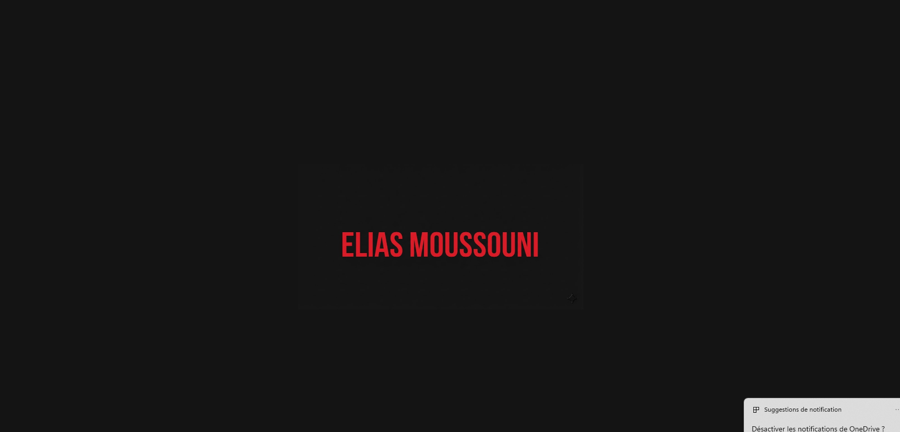
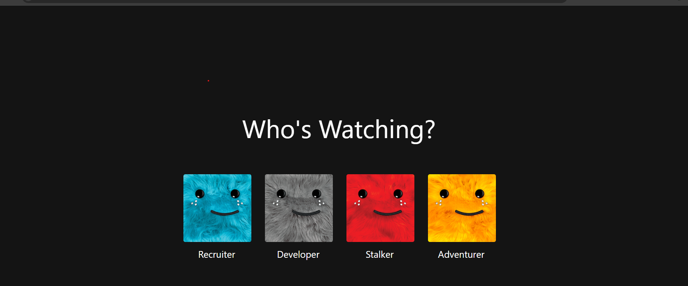
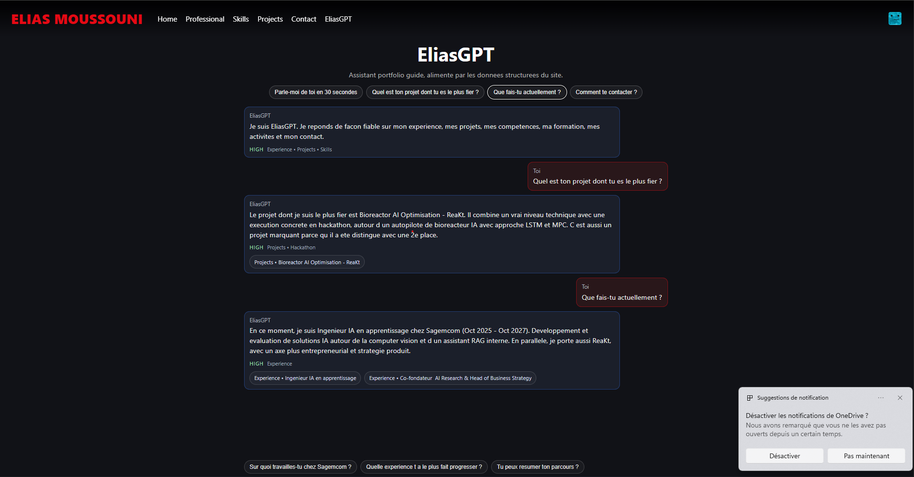
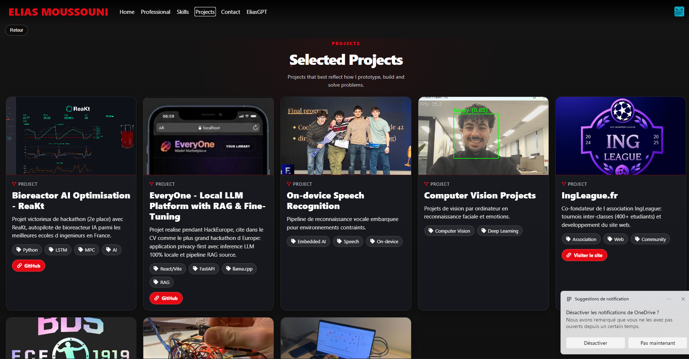
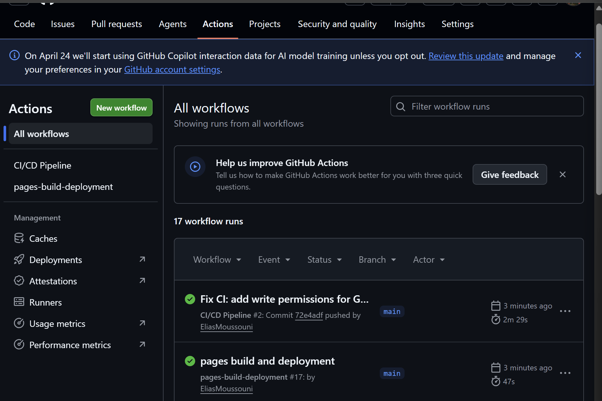
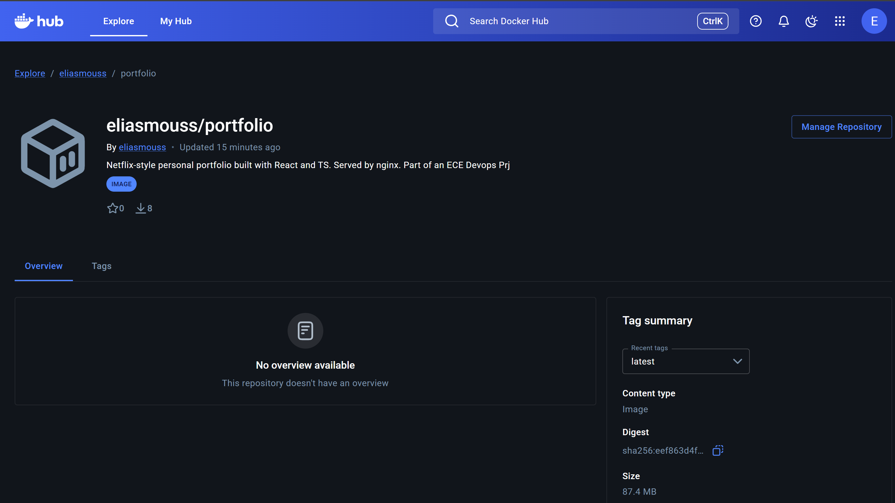
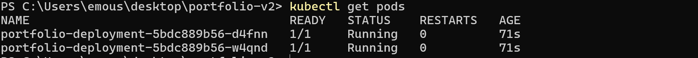
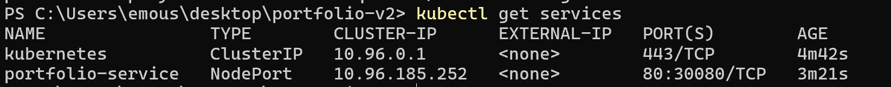
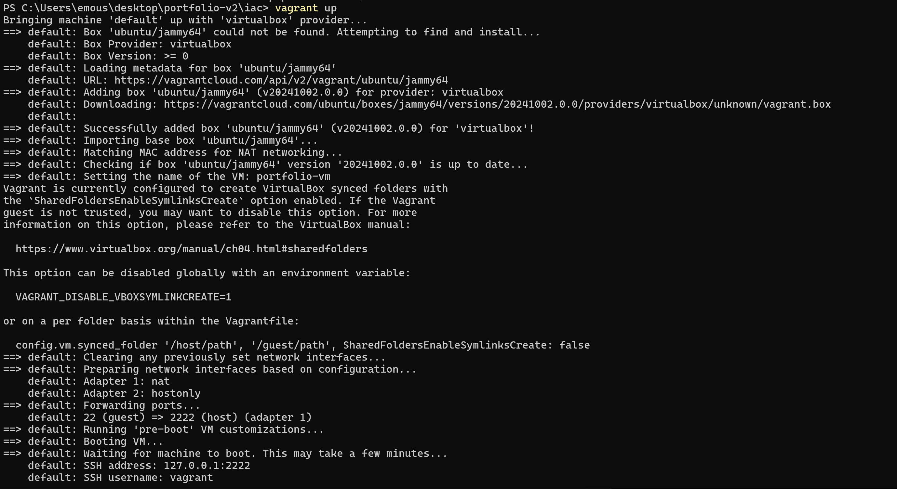
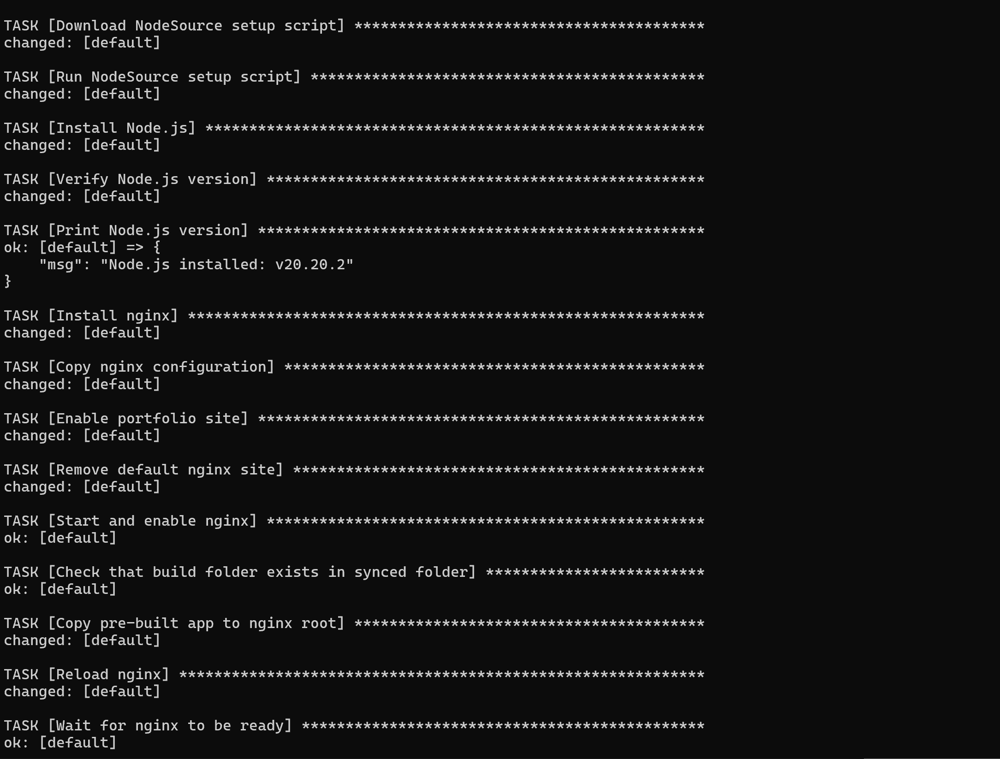

# DevOps Project — Elias Moussouni Portfolio

A Netflix-inspired personal portfolio built with React and TypeScript, featuring profile-based navigation, an AI assistant (EliasGPT), and deployed across multiple platforms. This project implements a full DevOps pipeline covering CI/CD, containerisation, IaC, and Kubernetes orchestration.

**Live site:** [www.eliasmoussouni.fr](https://www.eliasmoussouni.fr)

---

## Table of Contents

- [Work Performed](#work-performed)
- [Screenshots](#screenshots)
- [Installation](#installation)
- [Usage](#usage)
- [Testing](#testing)
- [CI/CD Pipeline](#cicd-pipeline)
- [Docker](#docker)
- [Infrastructure as Code](#infrastructure-as-code)
- [Kubernetes](#kubernetes)
- [Links](#links)
- [Author](#author)

---

## Work Performed

### Web Application
- Netflix-style portfolio with profile selection screen and full-screen sections
- Pages: Work Experience, Skills, Projects, Certifications, Recommendations, Contact, Music, Reading, Blogs
- **EliasGPT** — local-first AI assistant powered by a retrieval engine and a structured knowledge base (no backend required)
- Health check endpoint at `/health`
- Unit and component tests with React Testing Library and Jest

### CI/CD Pipeline
- GitHub Actions workflow (`ci.yml`) running on every push to `main`
- Steps: install dependencies → run tests → build → deploy to GitHub Pages
- Automatic deployment to GitHub Pages on successful build

### Docker
- Multi-stage Dockerfile (Node build → nginx static serving)
- Docker image published to Docker Hub
- Docker Compose file orchestrating the app container

### Infrastructure as Code (Vagrant + Ansible)
- Vagrantfile provisioning 1 Ubuntu 22.04 VM
- Ansible playbooks installing: Node.js runtime, nginx, the application
- Health check task verifying the app responds on port 80

### Kubernetes
- Minikube cluster with 2 manifest files
- `deployment.yaml` — runs the Docker Hub image
- `service.yaml` — exposes the app via NodePort on localhost

### Bonus Tasks
- Custom domain with Gandi DNS (`www.eliasmoussouni.fr`)
- Dual deployment: GitHub Pages + Vercel
- EliasGPT: local-first AI built entirely on the frontend with no API costs
- Netflix-inspired UI with Framer Motion animations and custom CSS

---

## Screenshots

### Application

| Home (Netflix-style) | Profile Page |
|---|---|
|  |  |

| EliasGPT | Projects Section |
|---|---|
|  |  |

### CI/CD — GitHub Actions



### Docker



### Kubernetes




### Vagrant VM




---

## Installation

### Prerequisites

- Node.js >= 18
- npm >= 9
- Docker & Docker Compose
- Vagrant + VirtualBox (for IaC)
- Minikube + kubectl (for Kubernetes)

### Clone the repository

```bash
git clone https://github.com/eliasmouss/portfolio-v2.git
cd portfolio-v2
npm install
```

---

## Usage

### Run locally

```bash
npm start
```

App runs at [http://localhost:3000](http://localhost:3000)

### Build for production

```bash
npm run build
```

Static files are output to `build/`.

### Run with Docker

```bash
docker pull eliasmouss/portfolio:latest
docker run -p 8080:80 eliasmouss/portfolio:latest
```

App runs at [http://localhost:8080](http://localhost:8080)

### Run with Docker Compose

```bash
docker compose up
```

App runs at [http://localhost:8080](http://localhost:8080)

### Run on Kubernetes (Minikube)

```bash
minikube start
kubectl apply -f k8s/deployment.yaml
kubectl apply -f k8s/service.yaml
minikube service portfolio-service
```

### Run on Vagrant VM

```bash
cd iac
vagrant up
```

The VM provisions itself automatically with Ansible. App is accessible at [http://192.168.56.10](http://192.168.56.10)

---

## Testing

### Unit and component tests

```bash
npm test -- --watchAll=false
```

Tests are located in `src/`:
- `App.test.tsx` — renders the app and checks key elements
- `src/eliasgpt/answerEngine.test.ts` — unit tests for the EliasGPT retrieval logic

### Health check

```bash
curl http://localhost:3000/health
# Expected: {"status":"ok"}
```

---

## CI/CD Pipeline

Configured with **GitHub Actions** at `.github/workflows/ci.yml`.

**Trigger:** every push to `main`

**Steps:**
1. Checkout repository
2. Setup Node.js 18
3. `npm ci` — install dependencies
4. `npm test -- --watchAll=false` — run tests
5. `npm run build` — production build
6. Deploy to GitHub Pages

---

## Docker

### Build the image locally

```bash
docker build -t portfolio .
```

### Multi-stage Dockerfile summary

- **Stage 1 (builder):** Node 18 Alpine — installs dependencies and builds the React app
- **Stage 2 (serve):** nginx Alpine — copies `build/` and serves on port 80

### Docker Hub

Image: `eliasmouss/portfolio:latest`

Docker Hub: [https://hub.docker.com/r/eliasmouss/portfolio](https://hub.docker.com/r/eliasmouss/portfolio)

---

## Infrastructure as Code

### Vagrant

```bash
cd iac
vagrant up       # Create and provision the VM
vagrant ssh      # Connect to the VM
vagrant halt     # Stop the VM
vagrant destroy  # Delete the VM
```

VM specs:
- OS: Ubuntu 22.04 (jammy64)
- Private IP: 192.168.56.10
- RAM: 1024 MB

### Ansible

Playbooks in `iac/playbooks/`:

| Playbook | Role |
|---|---|
| `install_node.yml` | Install Node.js 18 |
| `install_nginx.yml` | Install and configure nginx |
| `deploy_app.yml` | Copy app files and start serving |
| `healthcheck.yml` | Verify the app responds on port 80 |

Run manually (requires SSH access to the VM):

```bash
cd iac
ansible-playbook -i inventory.ini playbooks/deploy_app.yml
```

---

## Kubernetes

Manifests in `k8s/`:

### Apply all manifests

```bash
kubectl apply -f k8s/deployment.yaml
kubectl apply -f k8s/service.yaml
```

### Verify resources

```bash
kubectl get pods
kubectl get services
kubectl describe deployment portfolio-deployment
```

### Access the app

```bash
minikube service portfolio-service
```

---

## Links

| Platform | URL |
|---|---|
| Live site | [www.eliasmoussouni.fr](https://www.eliasmoussouni.fr) |
| GitHub Pages | [https://emouSS.github.io/portfolio-v2](https://emouSS.github.io/portfolio-v2) |
| Vercel | [https://portfolio-v2.vercel.app](https://portfolio-v2.vercel.app) |
| Docker Hub | [https://hub.docker.com/r/eliasmouss/portfolio](https://hub.docker.com/r/eliasmouss/portfolio) |

---

## Author

**Elias Moussouni**
- Email: elias.moussouni@edu.ece.fr
- LinkedIn: [elias-moussouni](https://www.linkedin.com/in/elias-moussouni-075410241/)
- GitHub: [@emouSS](https://github.com/emouSS)

*ECE Paris — DevOps Project — 2025/2026*
